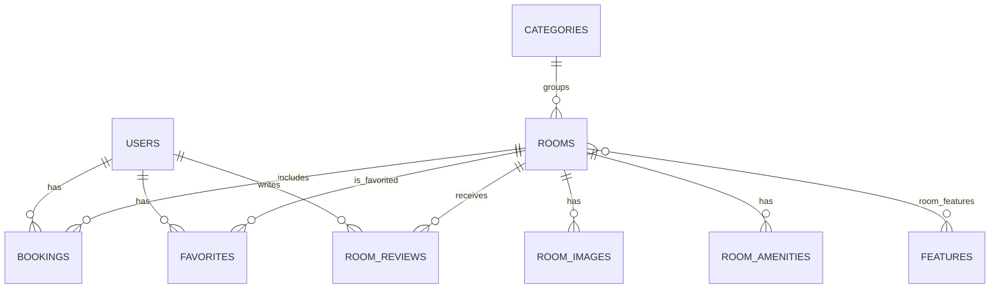

# HotelFlow
 
> "Seamless stays, endless possibilities"
 
HotelFlow es una aplicación Full Stack para explorar habitaciones, gestionar reservas y administrar el catálogo (panel admin). Incluye autenticación con JWT, favoritos, reseñas, historial de reservas, botón de WhatsApp y notificación por email post-reserva.
 
## Contenido
 
- [Tecnologías](#tecnologías)
- [Instalación local](#instalación-local)
- [Configuración Backend](#configuración-backend)
- [Configuración Frontend](#configuración-frontend)
- [Endpoints API](#endpoints-api)
- [Diagrama de Base de Datos](#diagrama-de-base-de-datos)
- [Testing](#testing)
- [Deploy](#deploy)
 
## Tecnologías
 
**Frontend**
- React 19.1.1
- Vite 7.1.12
- Tailwind CSS 3.4.17
- react-router-dom 7.9.3
- i18next / react-i18next
- Jest 30.2.0
 
**Backend**
- Java 17
- Spring Boot 3.5.6
- Spring Security (JWT)
- Spring Data JPA
- Spring Mail (SMTP)
- H2 Database (dev)
- Maven
 
## Instalación local
 
**Requisitos**
- Node.js 18+ (recomendado 20+)
- Java 17
- Git
 
1) Clonar el repo
 
```bash
git clone <URL_DEL_REPO>
cd ProjectDigitalHouse
```
 
2) Backend
 
```bash
cd backend
./mvnw spring-boot:run
```
 
3) Frontend
 
```bash
cd ../frontend
npm install
npm run dev
```
 
**URLs**
- Frontend: http://localhost:5173
- Backend API: http://localhost:8082/api
- H2 Console: http://localhost:8082/h2-console
 
## Configuración Backend
 
**Base de datos**
- Por defecto usa **H2 en memoria** (sin instalación adicional) y carga datos demo desde `backend/src/main/resources/data.sql`.
- Si querés migrar a MySQL/PostgreSQL, ejemplo de creación (MySQL):
 
```sql
CREATE DATABASE hotelflow;
```
 
**Variables de entorno**
- Existe un ejemplo en `backend/.env.example`.
- Spring Boot lee estas variables desde el entorno del proceso (no se cargan automáticamente desde `.env`).
 
Variables principales:
- `JWT_SECRET`: clave para firmar JWT (dev: `dev-secret-change-me`)
- `JWT_ISSUER`: issuer del token (dev: `hotelflow`)
- `JWT_EXPIRATION_MINUTES`: expiración del token en minutos (dev: `60`)
- `APP_FRONTEND_URL`: URL del frontend para CORS / links (dev: `http://localhost:5173`)
- `SMTP_USERNAME` / `SMTP_PASSWORD`: credenciales SMTP para enviar el email post-reserva (para Gmail usar App Password)
- `NOTIFICATIONS_OWNER_EMAIL`: email de contacto/proveedor que se muestra y se usa como copia cuando aplica

En macOS/Linux (zsh/bash), antes de levantar el backend:
 
```bash
export JWT_SECRET="dev-secret-change-me"
export JWT_ISSUER="hotelflow"
export JWT_EXPIRATION_MINUTES="60"
export APP_FRONTEND_URL="http://localhost:5173"
 
export SMTP_USERNAME="your-email@gmail.com"
export SMTP_PASSWORD="your-app-password"
export NOTIFICATIONS_OWNER_EMAIL="provider-contact@example.com"
```
 
## Configuración Frontend
 
**Variables de entorno**
- Existe un ejemplo en `frontend/.env.example`.
- Para desarrollo local, creá `frontend/.env`:
 
```bash
VITE_API_URL=http://localhost:8082/api
```
 
## Endpoints API
 
| Método | Endpoint | Descripción | Auth |
|---|---|---|---|
| POST | `/api/auth/register` | Registro de usuario | No |
| POST | `/api/auth/login` | Login (retorna JWT) | No |
| GET | `/api/rooms/paginated` | Listado paginado de habitaciones | No |
| GET | `/api/rooms/{id}` | Detalle de habitación | No |
| GET | `/api/rooms/search` | Búsqueda (destino/fechas/filtros) | No |
| GET | `/api/rooms/{roomId}/availability` | Rangos ocupados para calendario | No |
| POST | `/api/bookings` | Crear reserva | Sí |
| GET | `/api/bookings/me` | Historial de reservas del usuario | Sí |
| PATCH | `/api/bookings/{bookingId}/cancel` | Cancelar una reserva | Sí |
| GET | `/api/favorites/rooms` | Favoritos del usuario | Sí |
| POST | `/api/favorites/{roomId}` | Agregar favorito | Sí |
| DELETE | `/api/favorites/{roomId}` | Quitar favorito | Sí |
| GET | `/api/rooms/{roomId}/reviews` | Listado de reseñas de una habitación | No |
| POST | `/api/reviews` | Crear/editar reseña | Sí |
| POST | `/api/email/resend-confirmation` | Reenviar mail de confirmación | No |
 
## Diagrama de Base de Datos
 

 
## Testing
 
**Frontend**
 
```bash
cd frontend
npm run lint
npm test
```
 
**Backend**
 
```bash
cd backend
./mvnw test
```
 
## Capturas / video

- Recomendado: agregar imágenes o un video corto del flujo (home, detalle, reserva, historial, admin) en `docs/` y linkearlos acá.

## Deploy

**Demo online**
- Frontend: https://hotelflowdigital.netlify.app/

**Frontend (Recomendado: Vercel o Netlify)**
- Ambas plataformas son gratuitas y se conectan directamente a tu repositorio de GitHub.
- Configuración en Vercel/Netlify:
  - Framework: Vite
  - Build Command: `npm run build`
  - Output Directory: `dist`
  - Recordá configurar la variable de entorno `VITE_API_URL` apuntando a tu backend de producción.

**Backend (Recomendado: Render o Koyeb)**
- Se incluye un `Dockerfile` en el directorio `backend/` listo para ser desplegado en servicios que soporten contenedores (como Koyeb o Render).
- **Base de datos:** Por defecto usará H2 (los datos se reinician al apagarse el servidor). Si deseás persistencia gratuita, podés usar [Aiven](https://aiven.io/) (MySQL/PostgreSQL) o [Neon](https://neon.tech/) (PostgreSQL) y configurar la URL en tus variables de entorno.
